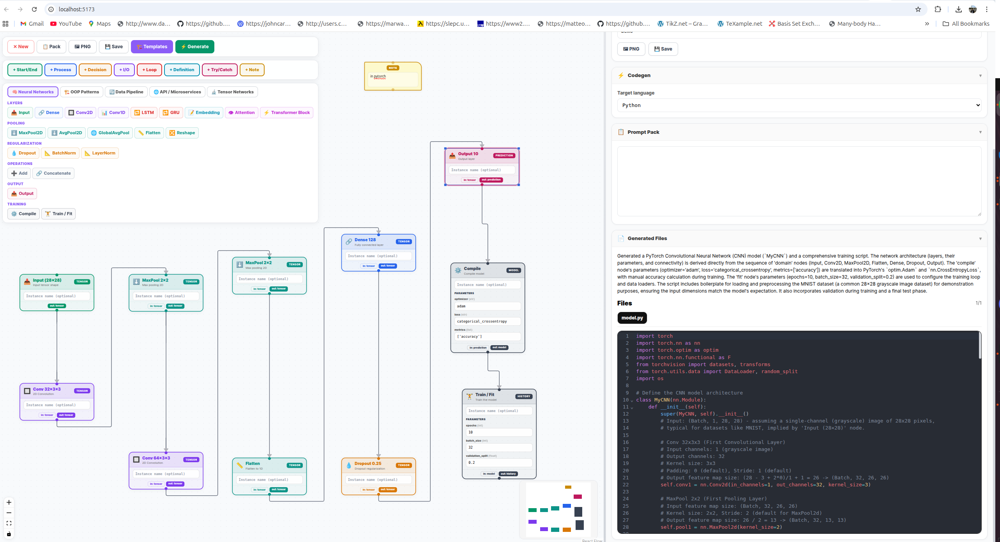

# Flow2Code
### Visual Flowchart Programming in the Age of LLMs

[](https://opensource.org/licenses/MIT)
[](http://makeapullrequest.com)

**Flow2Code** is a spatial programming environment designed to orchestrate Large Language Models through an intuitive, node-based interface. Stop fighting with nested prompt strings and start mapping your AI's logic visually.

---

## 🧠 Why Flow2Code?

* **From "Magic" to Maps:** LLM interactions often feel like a black box. This project turns unpredictable text prompts into **deterministic visual flows**, allowing you to audit, debug, and understand exactly how your AI arrives at an answer.
* **Syntax-Free Scalability:** As LLM chains grow in complexity, code becomes a tangled mess of nested functions. By using a **node-based architecture**, you can scale your AI logic horizontally without getting lost in "if-else" hell.
* **The Bridge for Non-Coders:** We are entering an era where domain experts need to shape AI behavior. This interface provides a **common language** for developers and creative strategists to collaborate on the same canvas.

---

## ✨ Key Features

* **Drag-and-Drop Orchestration:** Connect LLMs, Vector Databases, and API tools with simple visual wires.
* **Real-Time Execution Trace:** Watch data flow through your nodes in real-time to spot bottlenecks.
* **Modular Node System:** Easily create custom nodes for specific tasks (e.g., Sentiment Analysis or PDF Parsing).
* **Versioned Prompting:** Save and swap prompt versions within individual nodes without breaking the entire chain.

---

## 🚀 Quick Start

### 1. Installation
```bash
git clone [https://github.com/y-javanmard/flow2code.git](https://github.com/y-javanmard/flow2code.git)
cd flow2code
npm install
```




-----

### 2. Configure Environment
Create a .env file in the root directory and add your API keys:

# AI Provider Keys
OPENAI_API_KEY=your_openai_key_here
ANTHROPIC_API_KEY=your_claude_key_here

# Optional: Database or Tooling Keys
DATABASE_URL=your_db_connection_string
PINECONE_API_KEY=your_vector_db_key


## then run:
```bash
npm run dev
```
and open the http url.